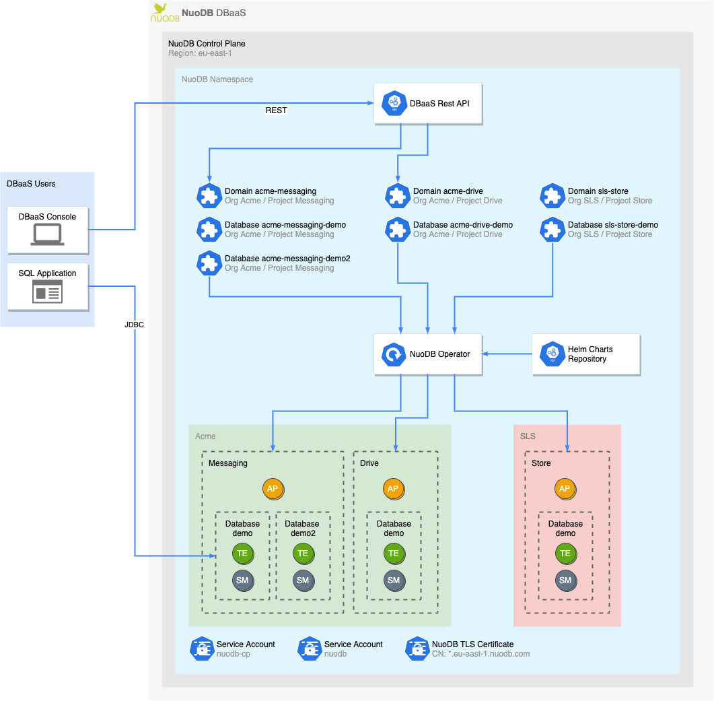

# NuoDB Control Plane

This repository is for releases and documentation for the NuoDB Control Plane, which enables automatic management of NuoDB databases in Kubernetes.

NuoDB Control Plane allows users to provision NuoDB databases on-demand remotely using REST services by exposing various predefined configuration options.
NuoDB domain and database are modeled as Kubernetes [Custom Resources][1] (CRs).
Their [Custom Resource Definitions][2] (CRDs) act as contracts between NuoDB Operator and the other modules.



## Documentation

The NuoDB Control Plane documentation is available in [docs](./docs) directory of this repository.
The REST API non-interactive documentation is available at [API documentation][3].

### Get Started

- [Quick Start Guide](./docs/QuickStart.md)

## Installation

To install the NuoDB Control Plane into your Kubernetes cluster, first add the Helm repository for the NuoDB Control Plane Helm charts.

```sh
helm repo add nuodb-cp https://nuodb.github.io/nuodb-cp-releases/charts
```

You can verify that the repo has been added by executing `helm search repo` to list the available Helm charts:

```console
$ helm repo add nuodb-cp https://nuodb.github.io/nuodb-cp-releases/charts
"nuodb-cp" has been added to your repositories

$ helm search repo nuodb-cp
NAME                      	CHART VERSION	APP VERSION	DESCRIPTION
nuodb-cp/nuodb-cp-crd     	2.1.1        	2.1.1      	NuoDB Control Plane custom resource definitions...
nuodb-cp/nuodb-cp-doc     	2.1.1        	2.1.1      	Interactive documentation for the NuoDB Control...
nuodb-cp/nuodb-cp-operator	2.1.1        	2.1.1      	NuoDB Control Plane Operator
nuodb-cp/nuodb-cp-rest    	2.1.1        	2.1.1      	NuoDB Control Plane REST service
```

The NuoDB Control Plane can now be installed as follows:

```sh
helm install nuodb-cp-crd nuodb-cp/nuodb-cp-crd
helm install nuodb-cp-operator nuodb-cp/nuodb-cp-operator
helm install nuodb-cp-rest nuodb-cp/nuodb-cp-rest
```

## Helm charts

There are several Helm charts for installing the various components of the NuoDB Control Plane.

- `nuodb-cp-crd` contains [custom resource definitions](https://kubernetes.io/docs/tasks/extend-kubernetes/custom-resources/custom-resource-definitions/) used by the NuoDB Control Plane to manage NuoDB domains and databases.
This must always be installed.
- `nuodb-cp-operator` contains the [Kubernetes operator](https://kubernetes.io/docs/concepts/extend-kubernetes/operator/) for managing NuoDB domains and databases.
This must always be installed.
- `nuodb-cp-rest` contains a REST service that exposes access to the NuoDB Control Plane in a Database as a Service (DBaaS) model.
This allows users without access to Kubernetes APIs to manage NuoDB domains and databases.
- `nuodb-cp-doc` exposes an endpoint for interactive documentation of the NuoDB Control Plane REST service.
See [api-doc](https://nuodb.github.io/nuodb-cp-releases/api-doc) for non-interactive documentation of the REST service.

## Dependencies

The NuoDB Control Plane depends on Kubernetes version 1.19 or later.

Additional dependencies are listed below.

### Ingress controller

An Ingress controller can be used to enable external connectivity to the NuoDB Control Plane REST API and to the databases created by it.
The [HAProxy Ingress Controller](https://github.com/haproxytech/kubernetes-ingress) can be installed as follows:

```sh
helm repo add haproxytech https://haproxytech.github.io/helm-charts
helm install haproxy-ingress haproxytech/kubernetes-ingress
```

### Cert-manager

To enable [admission webhooks](https://kubernetes.io/docs/reference/access-authn-authz/extensible-admission-controllers/) that perform synchronous validation of NuoDB custom resource definitions, [cert-manager](https://github.com/cert-manager/cert-manager) should be installed to automatically generate certificates for the webhook server.

This can be done as follows:

```sh
helm repo add jetstack https://charts.jetstack.io
helm install cert-manager jetstack/cert-manager
```

## Usage

To enable multi-tenancy, NuoDB _databases_ managed by the NuoDB Control Plane are grouped into _projects_, which are themselves grouped into _organizations_.

Create a NuoDB database as follows:

1. Create a project using the `PUT projects` REST endpoint:

```sh
curl -X PUT -H 'Content-Type: application/json' \
    $BASE_URL/projects/acme/messaging -d '{"sla": "dev", "tier": "n0.small"}'
```

2. Create a database using the `PUT databases` REST endpoint:

```sh
curl -X PUT -H 'Content-Type: application/json' \
    $BASE_URL/databases/acme/messaging/demo -d '{"dbaPassword": "dba"}'
```

>**Note**
> Projects and databases are identified by resource path segments `<organization>/<project>` and `<organization>/<project>/<database>`, respectively. The example above creates the database `demo` within the project `messaging` within the organization `acme`.

[1]: https://kubernetes.io/docs/concepts/extend-kubernetes/api-extension/custom-resources/#custom-resources
[2]: https://kubernetes.io/docs/concepts/extend-kubernetes/api-extension/custom-resources/#customresourcedefinitions
[3]: https://nuodb.github.io/nuodb-cp-releases/api-doc